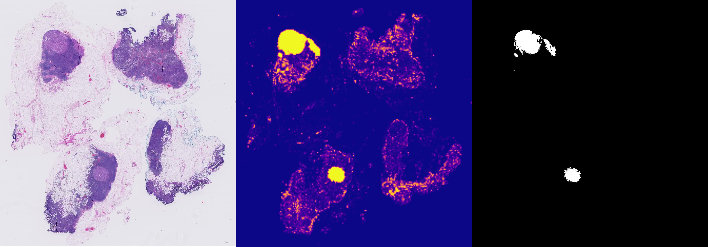
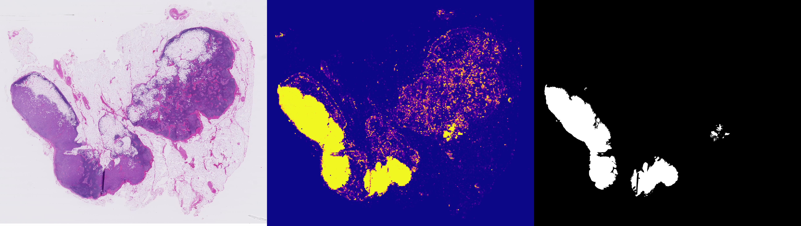

# metastasis-detection
PyTorch library for breast cancer metastasis detection in whole-slide images of sentinel lymph node tissue from the Camelyon dataset

# Description
This is an end-to-end library for training and evaluating a convolutional neural network (CNN) to classify patches from the PatchCamelyon dataset (https://github.com/basveeling/pcam), a pre-processed version of the Camelyon dataset (https://camelyon16.grand-challenge.org/). Furthermore, there is a script for performing whole-slide inference on test images from the Camelyon16 dataset which are multiresolution TIF files.

# Getting Started
This code was written and tested using Windows 10, Python 3.6.5, CUDA 10, and PyTorch 1.1. Other configurations are not guaranteed to work properly. 

Install the dependencies using the command:

`pip install -r requirements.txt`

## Data
Download all of the training, test, and validation HDF5 files from the PatchCamelyon (https://github.com/basveeling/pcam) repository into a separate folder. These will be used for training and testing the CNN. 

## Training
Run the train.py script with the desired arguments to train a CNN using the PatchCamelyon data. We use Visdom and tensorboardX to visualize the training results in the browser during training. To start the Visdom server locally run `python -m visdom.server` in a separate command prompt and then run `python train.py -args` in another command prompt. Open an internet browser such as Chrome and navigate to the URL printed in the Visdom command prompt (usually `http://localhost:8097` or something similar). 

## Evaluation
Create a separate folder `results/` for a CSV file to be saved with the testing results after running the `eval.py` script. Run the `eval.py` script with the appropriate arguments to test your trained CNN on the test data from the PatchCamelyon dataset.

## Whole slide Inference
Whole-slide inference can be performed on whole-slide images (WSI) provided by the Camelyon organizers. These are extremely large files in a multiresolution TIF format. The ASAP C++ interface is required in order to import image data from the SVS files. Go to https://github.com/computationalpathologygroup/ASAP to learn more about this library. With our configuration, we downloaded the Windows version of ASAP 1.8 which is stored locally in `C:\Program Files\ASAP 1.8`. In the `wsi_inference.py` script notice the import section at the top of the file.

```python 
import sys
sys.path.append(r'C:\Program Files\ASAP 1.8\bin')
try:
    import _multiresolutionimageinterface as mir
except ImportError:
    print("ASAP 1.8 not installed.")
```
This allows the C++ interface to be imported for use in this script. This may need to be modified depending on the configuration of your system. 

Below are examples of WSI predictions using our trained CNN (left to right: lymph node WSI, tumor probability map prediction, ground truth tumor regions).


